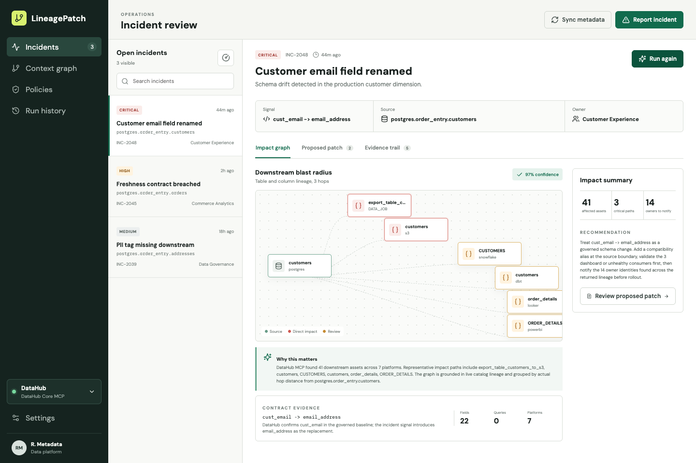
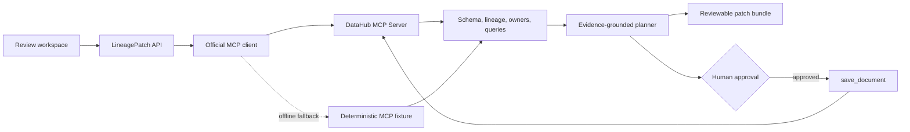

# LineagePatch

[](https://github.com/rbookki/lineagepatch/actions/workflows/ci.yml)
[](LICENSE)
[](https://docs.datahub.com/docs/features/feature-guides/mcp)

**From broken data contract to an explainable, reviewable patch.**

LineagePatch is a metadata-aware incident response workflow. It reads governed context from DataHub, traces the downstream blast radius, produces a code patch, and can publish an approved investigation back to DataHub so the next responder inherits the decision.

Built for the [Build with DataHub hackathon](https://datahub.devpost.com/).



## Why it exists

A renamed field can break transformations, dashboards, and ML features several hops away. The failure is visible immediately; the context needed to fix it is scattered across schemas, lineage, ownership, query history, and team knowledge.

LineagePatch turns that investigation into one guarded workflow:

1. **Observe:** resolve the affected asset, governed schema, ownership, usage, and three-hop lineage through the official DataHub MCP Server.
2. **Reason:** compare the incident signal with the catalog baseline and rank downstream paths by operational risk.
3. **Propose:** generate a compatibility patch and schema-contract update linked to the evidence that produced them.
4. **Act safely:** download the patch for repository review and, only after explicit approval, call `save_document` to preserve the investigation in DataHub.

The live showcase analysis finds **41 downstream assets across seven platforms**, including three critical paths and 14 owner identities.

## Thirty-second demo

Node.js 20 or newer is the only requirement for the offline judge experience.

```bash
npm ci
npm run dev
```

Open `http://127.0.0.1:4173`, choose **Customer email field renamed**, and select **Analyze impact**. The application uses a deterministic DataHub-shaped MCP fixture when a live DataHub connection is not available.

For a production-style build:

```bash
npm run build
npm start
```

Then open `http://127.0.0.1:4174`.

[](https://render.com/deploy?repo=https://github.com/rbookki/lineagepatch)

The hosted configuration runs the offline MCP fixture and requires no credentials.

## Run with DataHub Core

Requirements: Docker Desktop, Docker Compose v2, and Python 3.11 recommended.

```bash
python3.11 -m venv .venv-datahub
.venv-datahub/bin/python -m pip install --upgrade pip wheel setuptools
.venv-datahub/bin/python -m pip install 'acryl-datahub==1.6.0.13' 'mcp-server-datahub==0.6.0'

.venv-datahub/bin/datahub docker quickstart --version stable -f datahub-compose.yml
.venv-datahub/bin/datahub init --username datahub --password datahub
.venv-datahub/bin/datahub datapack load showcase-ecommerce

npm ci
npm run dev
```

DataHub opens at `http://localhost:9002` with local Quickstart credentials `datahub` / `datahub`. LineagePatch reads the GMS URL and short-lived token from `~/.datahubenv`, launches the official MCP server over stdio, and keeps the token on the server.

If DataHub is configured but temporarily unavailable, analysis explicitly falls back to the fixture instead of breaking the demo.

## Approved write-back

Mutation tools are off by default. To demonstrate the complete read-reason-write loop against DataHub Core:

```bash
DATAHUB_MCP_MUTATIONS=true npm run dev
```

Run a live analysis, open **Evidence trail**, select **Publish to DataHub**, review the exact scope, and select **Approve write**. The server then calls the official `save_document` MCP tool with:

- The evidence summary and recommendation
- The affected DataHub asset URN
- The proposed artifact list
- The safety decision and approval boundary

Automatic analysis never invokes mutation tools. Repeated approval in one server session is idempotent and returns the first published document.

## DataHub integration

The official MCP client discovers tools at runtime and uses:

| Tool | Purpose |
| --- | --- |
| `get_entities` | Resolve the source entity, ownership, tags, and assertions |
| `list_schema_fields` | Ground the contract comparison in governed fields |
| `get_lineage` | Trace direct and transitive downstream impact |
| `get_dataset_queries` | Inspect real usage evidence |
| `save_document` | Persist an approved incident memory back to DataHub |

Both local stdio and DataHub Cloud streamable HTTP transports are supported. Configure DataHub Cloud in `.env`:

```bash
DATAHUB_MCP_URL=https://<tenant>.acryl.io/integrations/ai/mcp/
DATAHUB_MCP_TOKEN=your-service-account-token
DATAHUB_MCP_MUTATIONS=false
```

## Architecture



## Sample outputs

Judges can inspect the proposed artifacts without running the application:

- [Compatibility SQL](examples/models/staging/stg_customers.sql)
- [Schema contract](examples/models/staging/stg_customers.yml)
- [Portable patch bundle](examples/inc-2048-lineagepatch.diff)
- [Approved incident memory](examples/incident-memory.md)

## Transparency

The three incoming incident signals are realistic demo scenarios. In live mode, schema fields, lineage, owners, platforms, health signals, and query usage come from the DataHub `showcase-ecommerce` catalog. The interface labels fixture runs and live DataHub MCP runs separately; fallback is never presented as live data.

Proposed code is not an automatic production change. It must pass repository review and tests before merge.

## Security model

- DataHub credentials remain server-side and are never returned to the browser.
- Read-only tools run automatically; mutation tools require an environment gate and an in-product approval step.
- The write-back endpoint only accepts a cached live analysis produced by the server.
- Secrets, local virtual environments, build output, and `.env` files are excluded from Git.

## Verification

```bash
npm test
npm run build
```

The repository includes unit tests for incident-specific planning, MCP negotiation, lineage responses, and the approved incident-memory artifact. GitHub Actions runs the same checks for every pull request.

## Project structure

```text
src/                 React review workspace
server/              API, MCP adapters, planner, and write-back gate
tests/               Unit and MCP protocol tests
examples/            Proposed artifacts for judge review
media/               Submission screenshots
submission/          Devpost copy and three-minute demo script
datahub-compose.yml  Reproducible DataHub Core environment
```

## License

Apache License 2.0. See [LICENSE](LICENSE).
